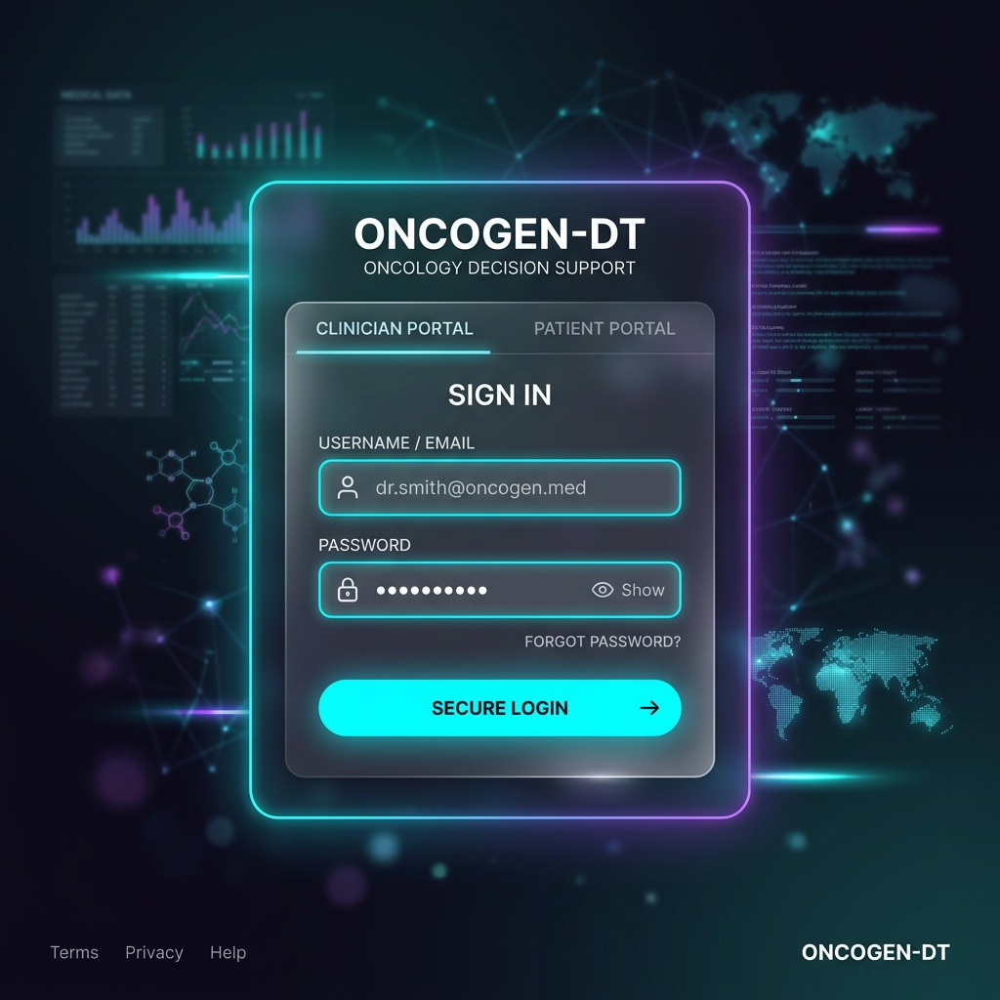
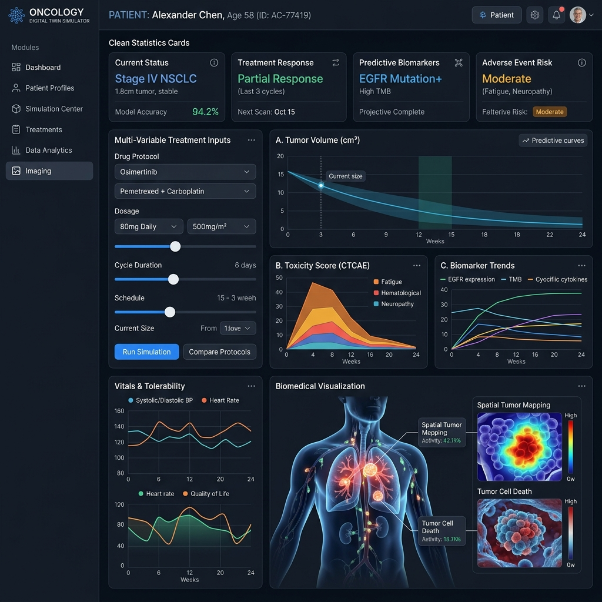
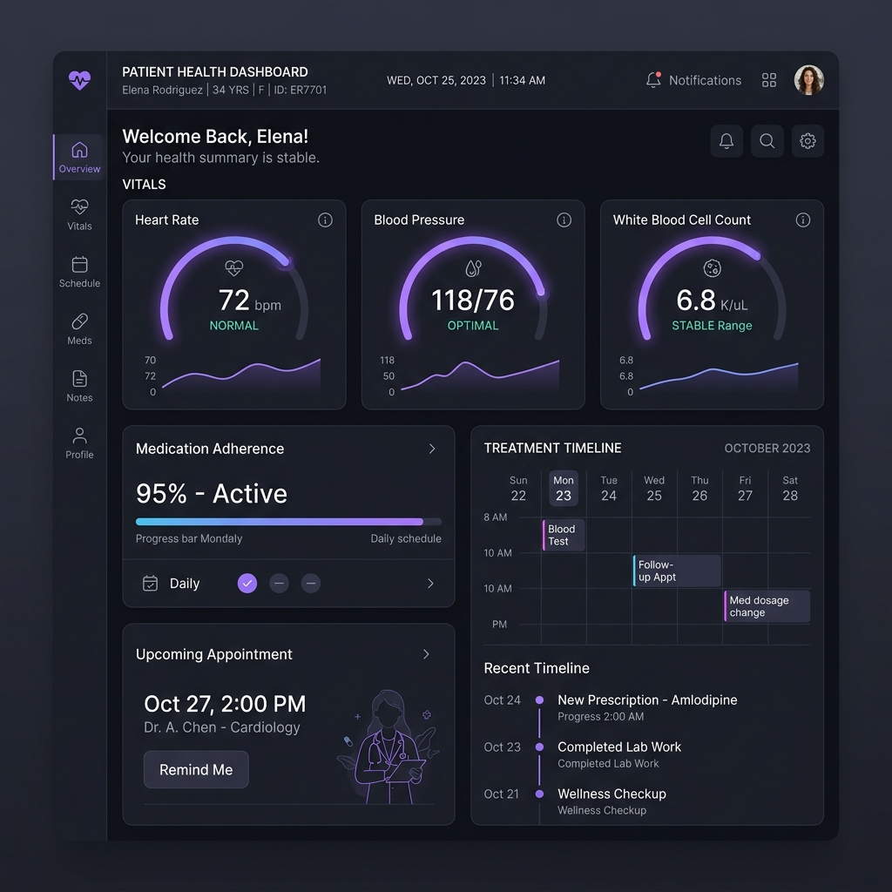

# Oncology Digital Twin & Multi-Variable Treatment Simulator

🚀 **Live Demo:** [https://satyampandey07.github.io/Oncology-DigitalTwin-OncoDT/](https://satyampandey07.github.io/Oncology-DigitalTwin-OncoDT/)

An advanced React-based digital twin application designed for clinicians and patients to simulate, analyze, and optimize multi-variable oncology treatments. The application leverages mathematical modeling running inside background threads (Web Workers) to simulate tumor dynamics, therapeutic response, drug clearance, and toxicity profiles over a 24-month horizon.

---

## Key Features

### Clinician Portal
- **Patient Directory**: Manage clinical states, cancer types (e.g., Breast, Lung, Colorectal), and active regimens.
- **Biomarker & Genomic Profiling**: Assess HER2, ER/PR, BRCA mutation status, and Ki-67 proliferative indices.
- **Regimen Simulator**: Set treatment type (Chemotherapy, Targeted, Immunotherapy, or Combination), cycle frequency, dosage intensity, and anticipated adherence rate.
- **Real-Time Visual Analytics**: Interactive dual-axis charts plotting tumor diameter/volume, PK drug concentration/efficacy, systemic toxicity levels, and patient health.
- **Nadir and Toxicity Analysis**: Track nadir values (lowest tumor volume reached), timeline milestones, and toxicity flags (e.g., high-risk thresholds, cardiac burden).

### Patient Portal
- **My Profile**: Access current status, diagnosis details, stage, and primary physician contact.
- **Vitals Monitoring**: Interactive gauges tracking heart rate, blood pressure, temperature, white blood cell (WBC) count, and overall systemic health score.
- **Treatment Timeline**: Track scheduled vs. completed therapy cycles, dosage logs, and upcoming procedures.
- **Simulation History**: View predictions and digital twin insights generated by the care team.

---

## Interface Previews & Explanations

### 1. Unified Authentication Gate (Clinician & Patient Portals)

*A sleek, glassmorphic login interface supporting tab-based context switching. Clinicians and patients authenticate using role-specific credentials, with active neon-glowing accents indicating the selected portal session.*

### 2. Multi-Variable Digital Twin Simulator (Clinician Dashboard)

*The clinician simulation dashboard interface. It houses input parameters for customizing chemotherapy, immunotherapy, or targeted therapy protocols, displaying real-time mathematical forecasts for tumor shrinkage, systemic toxicity levels, biomonitoring, and general patient vitals.*

### 3. Patient Vitals and Adherence Dashboard (Patient Portal)

*The patient-facing view tracking clinical logs, upcoming medical appointments, medication compliance rates, and real-time vital metrics including pulse rate, blood pressure, and white blood cell levels.*

---

## Simulation Architecture & Mathematical Models

The digital twin simulator runs on a separate thread via **Web Workers** (`src/simulationWorker.js`) to keep the main UI thread lag-free during intense computations. It combines three clinical models:

1. **Gompertzian Tumor Growth**:
   - Represents growth saturation where the growth rate decays exponentially as the tumor size approaches the lethal volume carrying capacity ($V_{max} = 3500\text{ cm}^3$).
   - Growth speed ($r$) is calculated dynamically using staging markers and the Ki-67 index.
   - Initial volume ($V_0$) is computed spherically from the baseline tumor diameter ($d$):
     $$V = \frac{4}{3}\pi\left(\frac{d}{2}\right)^3$$

2. **Pharmacokinetics (PK) & Efficacy**:
   - Models exponential drug clearance decay between cycles ($t_{1/2} \approx 7\text{ days}$).
   - Computes effective therapeutic killing ($K_{eff}$) influenced by dosage intensity and patient adherence rates.
   - Integrates genomic biomarker amplifiers (e.g., HER2 positive amplification for targeted therapies, BRCA mutations for chemotherapy).

3. **Systemic Toxicity & Vitals**:
   - Tracks dynamic toxicity spikes on dosing days, followed by metabolic clearance.
   - Computes drug-specific cardiac risks (e.g., anthracycline-induced cardiotoxicity proxy).
   - Dynamically depletes or recovers overall patient health/vitals depending on toxicity thresholds (e.g., toxic dose alerts if toxicity remains above $75\%$).

---

## Tech Stack

- **Framework**: React 18 (Vite-powered for fast bundling and HMR)
- **Styling**: TailwindCSS & PostCSS for a modern, responsive design system
- **Routing**: React Router DOM (v7) for secure role-based layouts (Doctor vs. Patient)
- **State Management**: React Context (`AuthContext.jsx`) for mock role selection and session simulation
- **Icons**: Lucide React
- **Worker Execution**: Inline Web Worker blobs (`simulationWorker.js`)

---

## Directory Structure

```text
├── public/                 # Static assets (Favicons, images)
├── src/
│   ├── components/         # Reusable dashboard widgets & panels
│   │   ├── AIDiagnosticsPanel.jsx    # Clinician ML diagnostics notes
│   │   ├── BodyDiagram.jsx           # SVG anatomical representation of cancer sites
│   │   ├── DrugCard.jsx              # Regimen details and dosage indicators
│   │   ├── DrugComparisonChart.jsx   # Multi-drug comparison overlays
│   │   ├── GenomicPanel.jsx          # Biomarkers and genetic toggle statuses
│   │   ├── KPICard.jsx               # Quick stat summaries
│   │   ├── LabResultsTable.jsx       # Tabular bloodwork & hematology data
│   │   ├── TreatmentTimeline.jsx     # Visual schedule tracking
│   │   └── VitalsGauges.jsx          # Patient vitals dashboard gauges
│   ├── context/
│   │   └── AuthContext.jsx # App security and user role control
│   ├── data/               # Clinician databases and patient records
│   ├── pages/              # Portal layouts and page views
│   │   ├── doctor/         # Clinician dashboards, patient detail, simulator
│   │   └── patient/        # Patient profile, vitals, timeline dashboards
│   ├── utils/              # Helper functions & formatter tools
│   ├── App.jsx             # Router and layout configurations
│   ├── index.css           # Global typography and Tailwind styles
│   ├── main.jsx            # React root mount point
│   └── simulationWorker.js # Background thread simulation mathematical logic
├── tailwind.config.js      # Styling rules and palettes
└── vite.config.js          # Vite build parameters
```

---

## Getting Started

### 📋 Prerequisites
- **Node.js**: `v18.x` or higher
- **npm**: `v9.x` or higher

### Installation
1. Clone the repository or navigate to the project directory:
   ```bash
   git clone https://github.com/SatyamPandey07/oncology-digital-twin-simulator.git
   cd oncology-digital-twin-simulator
   ```

2. Install dependencies:
   ```bash
   npm install
   ```

3. Run the development server:
   ```bash
   npm run dev
   ```

4. Open [http://localhost:5173](http://localhost:5173) in your browser.

### Build & Deploy
To create a production-optimized build:
```bash
npm run build
```
This outputs a compiled, minified bundle to the `dist/` directory ready for static hosting.
